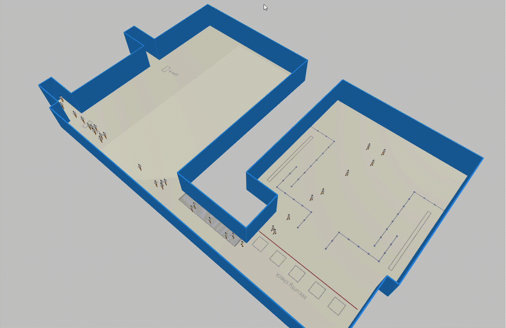
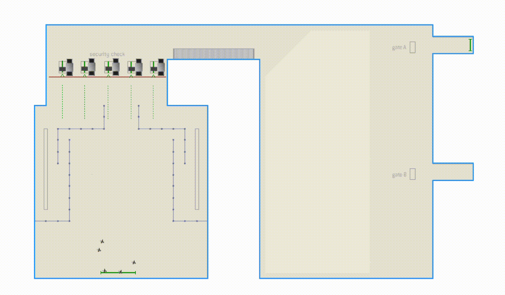
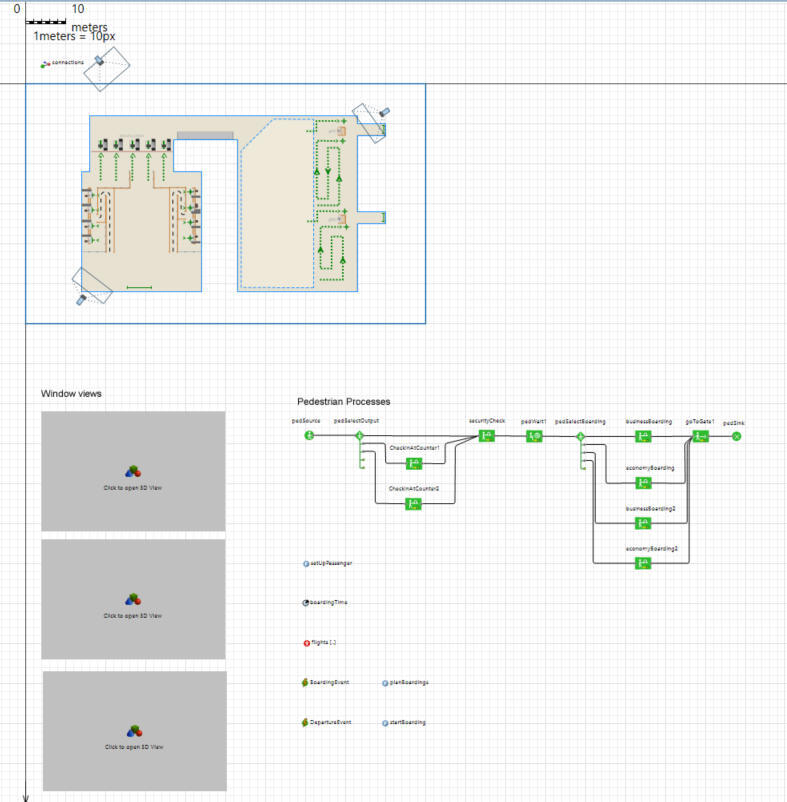

# AnyLogic Pedestrian & Queuing Simulation Demos

This repository contains visual demonstrations of pedestrian flow, queuing, and service behavior modeled in **AnyLogic**. The animations illustrate different stages of the model development and design.

---

## 📁 Project Files Overview

### 0. Initial Commit
Demonstrates the initial setup of the model environment.

---

### 1. Security Checkpoints
Shows pedestrian interaction with security checkpoint service points.

---

### 2. Queuing – Waiting Station (Version 1)
Early implementation of pedestrian queuing behavior at a waiting station.

---

### 3. Queuing – Waiting Station (Enhanced)
Improved and extended queuing logic with refined pedestrian flow dynamics.

#### GIF Preview

---

### 🎨 Final Design Layout
High-level visual design of the finalized model layout.

---

## 🛠 Tools & Concepts Used
- AnyLogic Pedestrian Library
- Continuous-space pedestrian modeling
- Linear and point-based service logic
- Queuing behavior under load
- Visual layout and animation export

---

## 📌 Notes
- GIFs are provided for quick previews.
- MP4 is included where higher resolution or smoother playback is required.
- All visuals are directly generated from simulation runs.

---

Feel free to explore, reuse, or extend the models for further pedestrian flow analysis.
``
